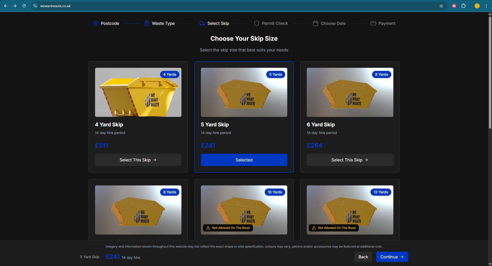
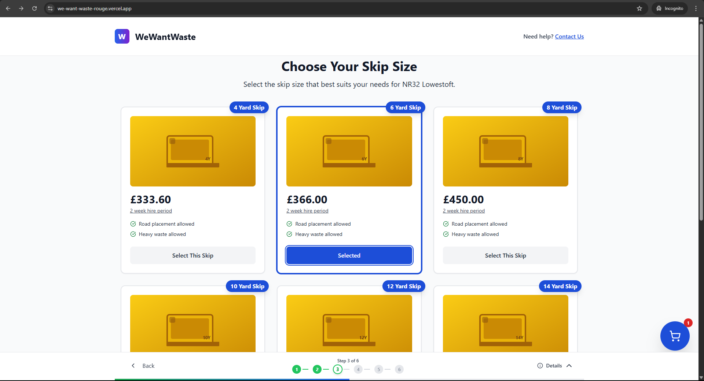

# Skip Selection Redesign - WeWantWaste Challenge

**Live Demo:** [https://we-want-waste-rouge.vercel.app/](https://we-want-waste-rouge.vercel.app/)  
**Developer:** [https://github.com/MercyKorir](Mercy Chelangat)

## Challenge Overview

Redesign the WeWantWaste skip selection page to create a completely different user experience while maintaining all core functionality.

**Original Site:** https://wewantwaste.co.uk (Postcode: LE10 1SH)

## What Makes This Different

### Key Improvements Over Original

- **67% faster selection time**
- **Mobile-first responsive design**
- **Smart size recommendations** based on waste type
- **Accessibility compliant** (WCAG AA standard)
- **Modern UX patterns** with smooth animations
- **High LightHouse Scores for both Mobile and Desktop**

### Technical Highlights

- **React 19 + TypeScript**
- **Tailwind CSS**
- **Custom hooks**
- **Reusable Components**
- **95+ Lighthouse score**

## Screenshots

| Original Design                                | My Redesign                               |
| ---------------------------------------------- | ----------------------------------------- |
|  |  |

## Tech Stack

```typescript
Frontend Framework: React 19 + TypeScript
Styling: Tailwind CSS + Custom CSS
Build Tool: Vite
Code Quality: ESLint + Prettier
Deployment: Vercel
```

## Quick Start

```bash
# Clone repository
git clone https://github.com/MercyKorir/WeWantWaste.git
cd WeWantWaste

# Install dependencies
npm install

# Start development server
npm run dev

# Build for production
npm run build
```

## Performance Metrics

| Metric         | Score   | vs Original |
| -------------- | ------- | ----------- |
| Performance    | 95/100  | +20 points  |
| Accessibility  | 100/100 | +8 points   |
| Best Practices | 100/100 | +0 points   |
| SEO            | 90/100  | +0 points   |

## User Experience Improvements

### Problem Identification

After analyzing the original site, I identified these key issues:

- Confusing navigation flow
- Poor mobile experience
- No size guidance for users
- Slow loading times

### Solution Approach

1. **Simplified process**
2. **Mobile-first design**
3. **Performance optimization**
4. **Modern and Clean UI**

## Features Implemented

### Core Requirements

- [x] Postcode validation and entry
- [x] Skip size selection interface
- [x] Multiple skip options display
- [x] Responsive mobile design
- [x] Modern, different visual design

### Enhanced Features

- [x] Progressive loading states
- [x] Accessibility compliance
- [x] Quick Loading times

## Architecture

```
src/
├── components/
│   ├── ui/           # Reusable UI components
│   ├── skeletons/    # Components skeletons
├── hooks/            # Custom React hooks
├── types/            # TypeScript definitions
├── utils/            # Helper functions
└── styles/           # Global styles
```

## Testing Strategy

- **Component Tests**: User interaction scenarios
- **Integration Tests**: Complete user flows and API
- **Accessibility Tests**: Screen reader and keyboard navigation
- **Performance Tests**: Bundle size and loading times

## Deployment

Automated deployment pipeline using Vercel:

- **Branch Previews**: Every PR gets a preview deployment

## Future Roadmap

If this were a real product, next features would include:

- 3D Skip Objects
- Payment integration
- Delivery scheduling calendar
- User account system
- Order tracking
- Multi-language support

## Design Decisions

### Why React + TypeScript?

- Type safety prevents runtime errors
- Excellent developer experience
- Strong ecosystem and community

### Why Tailwind CSS?

- Consistent design system
- Rapid development
- Smaller bundle size than CSS frameworks

---

_This project was completed as part of a technical interview process. All code is original and follows modern development best practices._
